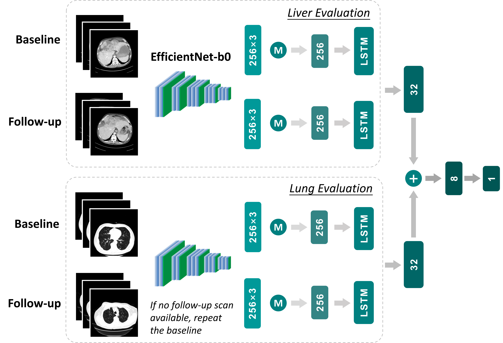
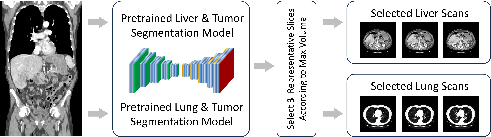

# Prognostic Risk Prediction Model for Hepatocellular Carcinoma Using CT scans
This is the Github Repository for "Deep Learning-Based Overall Survival Prediction in Immunotherapy-Treated Hepatocellular Carcinoma Patients Using CT scans".



## Getting started
### Dependencies
This project requires Python 3 (3.7.13) with the following additional packages:
* [captum](https://pypi.org/project/captum/) (0.6.0)
* [grad_cam](https://pypi.org/project/grad-cam/) (1.4.8)
* [lifelines](https://pypi.org/project/lifelines/) (0.27.8)
* [matplotlib](https://matplotlib.org/) (3.5.2)
* [monai](https://pypi.org/project/monai/) (0.9.1)
* [NumPy](https://numpy.org/) (1.21.2)
* [pandas](https://pandas.pydata.org/) (1.3.5)
* [pycox](https://pypi.org/project/pycox/) (0.2.3)
* [scikit-learn](https://scikit-learn.org/stable/) (0.22.2)
* [SimpleITK](https://pypi.org/project/SimpleITK/) (2.0.2)
* [PyTorch](https://pytorch.org/) (torch==1.11.0, torchvision==0.12.0) with CUDA support

The numbers in parentheses denote the versions used during development of this project. Other python and package versions may or may not work as intended.

A requirements file is provided in the root of this project and can be used to install the required packages via `pip install -r requirements.txt`. If the process fails, you may need to upgrade setuptools via `pip install --upgrade setuptools`.

### Train a model by yourself
To train a model, you should prepare:
1. A .json file that contains splits information. (Defualt=dataset_split.json)
2. A .csv file that contains labels, i.e., Subject_id, time, event. (Default=os_info.csv)
3. Two folders ("liver_img" and "lung_img") contain the selected 2D CT scans from 3D whole body CT scan. Default we choose 3 slices from liver and lung at each timepoint.



Note: To automatically get the slice with the largest tumor volume, state-of-the-art pretrained segmentation models can be downloaded from [here](https://zenodo.org/record/3734294#.YXwB755Bw2z). If necessary, please refer to the [nnU-Net](https://github.com/MIC-DKFZ/nnUNet/).

Then, run te following command:
```
python train.py --base YOUR/WORKING/PATH --label os_info.csv --splits dataset_split.json --model Rad-D
```
|  command  | description |
| ------------------- | ------------- |
| `--base`  | working base directory |
| `--label`  | csv file recorded time and event |
| `--splits`  | json file to split the data |
| `--model`  | only Rad-D and Rad-S available |
| `--max_epoch`  | maximum training epoch |
| `--lr`  | learning rate |

## Contact
If you have any question, please contact this [Email](mailto:Estelle-xyj@sjtu.edu.cn).
